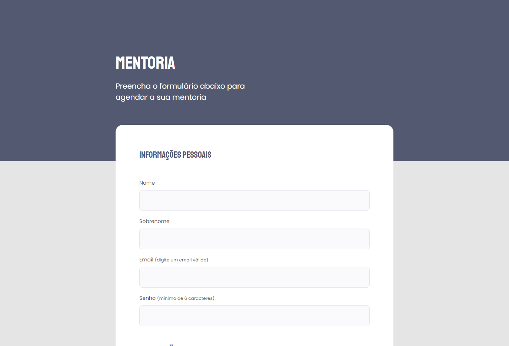

# Desafio - Criando formulários

> Explorer Stage 03 da Rocketseat

## 📝 Descrição
Projeto desenvolvido no curso Explorer da Rocketseat. 

A proposta era criar um formulário de mentoria com os conhecimentos adquiridos.

🔗 [Clique aqui para acessar](https://daniyuk.github.io/explorer-formulario-01/)

[Design no figma](https://www.figma.com/file/Nws1KWB7DyXBw8L6wXb9mp/Stage-03---Formul%C3%A1rio-intermedi%C3%A1rio/duplicate)

## 💻 Tecnologias 
- HTML
- CSS